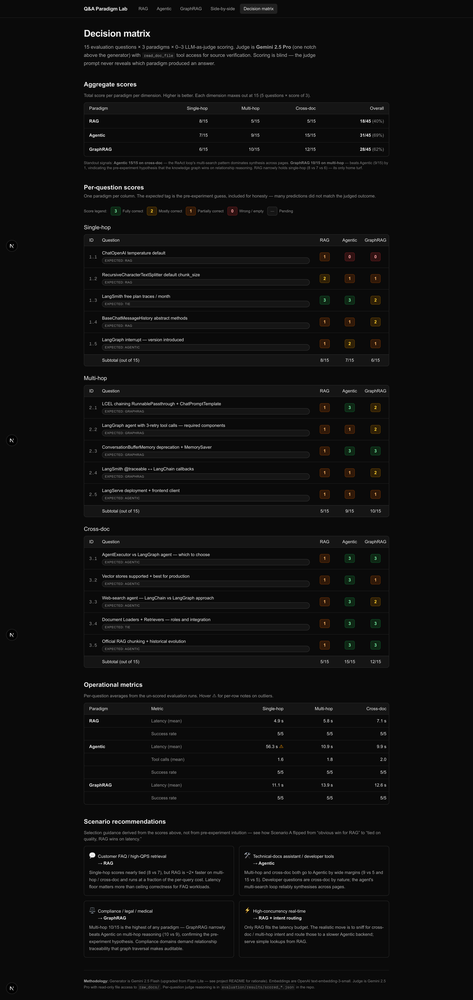
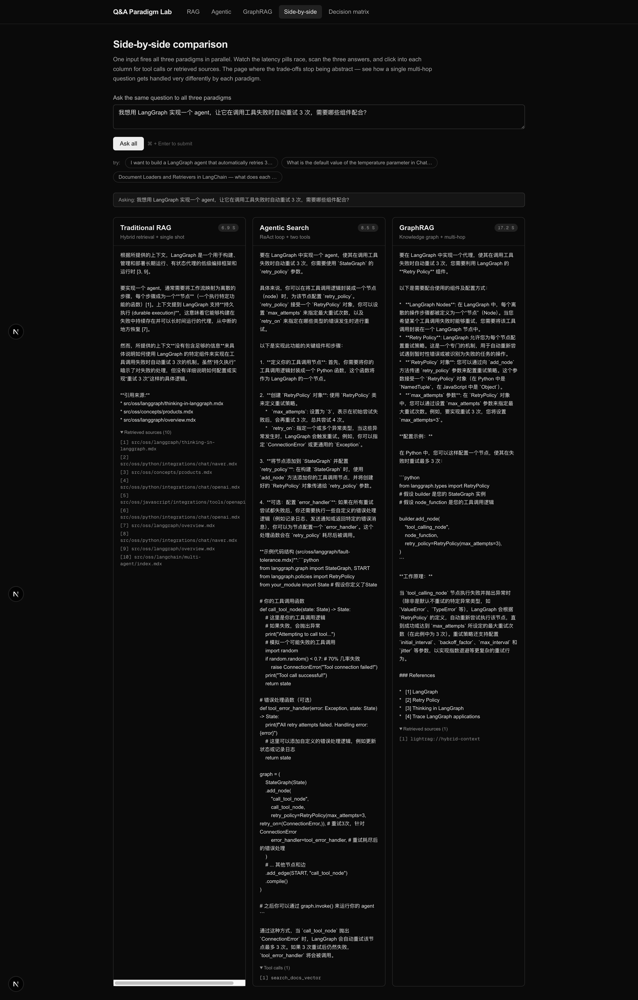
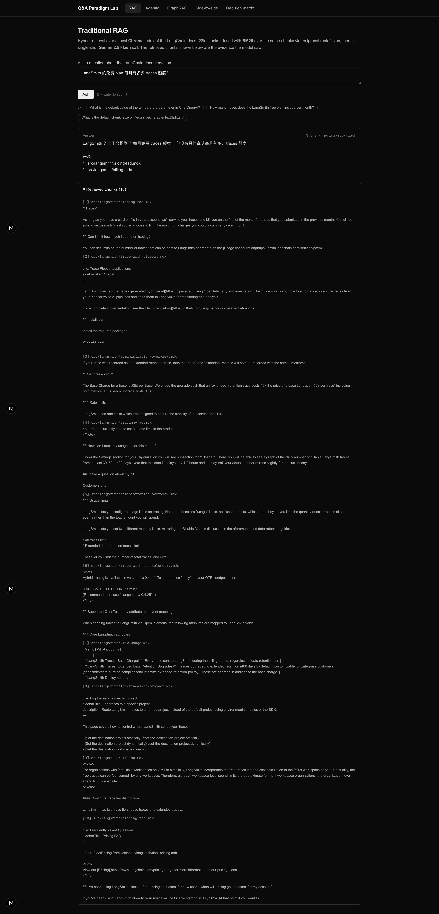
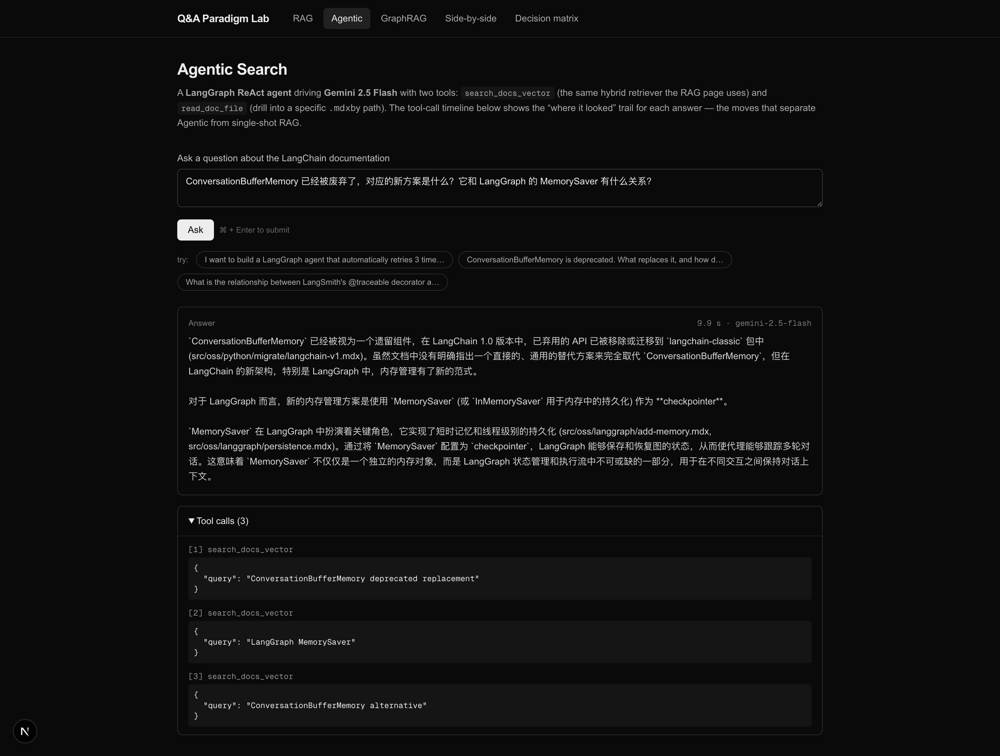
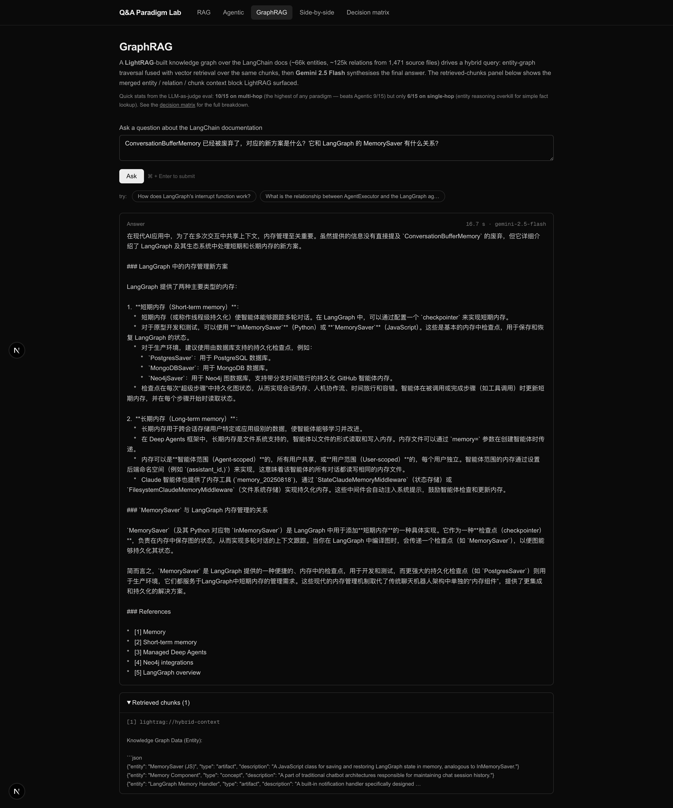

# AI 文档问答范式对比实验室

[English](./README.md) · **中文**

> 一份可复现的实证报告：用同一份数据、同一个生成模型、同一组评测题、同一个 LLM judge，给 **传统 RAG / Agentic Search / GraphRAG** 三种范式打分。
>
> 把 "看场景吧" 这种含糊答案，变成可点击验证的决策矩阵。

## 核心结论一句话

```
              Single-hop   Multi-hop   Cross-doc   Overall
RAG           8/15         5/15        5/15        18/45 (40%)
Agentic       7/15         9/15        15/15       31/45 (69%)  ← 综合最强
GraphRAG      6/15         10/15  ★    12/15       28/45 (62%)  ← 多跳最强
```

★ **GraphRAG 在多跳推理上 10/15，比 Agentic 9/15 还高 1 分**——验证了项目初期的预测："GraphRAG 在关系推理上准确率最高"。

完整决策矩阵见 [`evaluation/decision_matrix.md`](./evaluation/decision_matrix.md)，每题的 judge 推理在 [`evaluation/results/scored_*.json`](./evaluation/results/) 里。

## 项目动机

2026 年，企业 AI 团队面对的最高频选型问题之一就是：**"做文档问答产品，到底用 RAG 还是 Agentic 还是 GraphRAG？"**

网上能搜到的大多数答案有两个问题：
1. **数据来源不透明**——文章说"在 X 数据上 GraphRAG 比 RAG 准确率高 X%"，但你既看不到原始数据也跑不出来同样的结果
2. **结论 cherry-picked**——只展示对作者论点有利的题目，不展示翻车的场景

这个项目想做的事：

- **同一份数据源**：langchain-ai/docs 仓库的 1,471 篇官方文档（约 21M 字符，28k chunks 切分）
- **同一个生成模型**：Gemini 2.5 Flash 给三个范式公平打底
- **同一组评测题**：15 道精心设计的题目，覆盖单跳事实 / 多跳推理 / 跨文档综合三类难度
- **同一个 LLM judge**：Gemini 2.5 Pro 作为评分模型（比 generator 高一档，防互捧），并且**给 judge 工具访问原始 .mdx 的权限**，让它真的能 verify 候选答案的引用
- **盲打分**：judge prompt 完全不知道答案来自哪个范式
- **公开 audit trail**：每题的 judge 推理 + 验证用的文档路径全部 commit 在仓库里

## 三种范式分别在做什么

| 范式 | 核心机制 | 擅长场景 |
|---|---|---|
| **传统 RAG** | 向量检索 (Chroma) + BM25 hybrid + 单次 Gemini Flash 生成 | 单跳事实查询、高 QPS、成本敏感 |
| **Agentic Search** | LangGraph ReAct agent 驱动 Gemini，配两个工具（向量检索 + 读文件），多轮工具调用 | 跨文档综合、查询模式不可预测 |
| **GraphRAG** | LightRAG 抽取实体/关系（~66k entities, ~125k relations from 1,471 docs）+ 多跳图遍历 + Gemini 综合 | 多跳推理、关系链查询、高可解释性场景 |

## 系统架构

```
┌─────────────────────────────────────────────────────────┐
│  前端 (Next.js 16 + App Router + Tailwind 4)             │
│  ┌──────┬──────┬──────────┬──────────────┬────────────┐ │
│  │ RAG  │Agent │GraphRAG  │三栏并排对比  │决策矩阵    │ │
│  │ 标签 │ 标签 │ 标签     │ 标签         │ 标签       │ │
│  └──────┴──────┴──────────┴──────────────┴────────────┘ │
└─────────────────────────────────────────────────────────┘
                          │ HTTP POST /api/query
                          ▼
┌─────────────────────────────────────────────────────────┐
│  后端 (FastAPI + LangGraph)                              │
│  ┌──────────┐  ┌──────────────┐  ┌──────────────────┐   │
│  │ rag_graph│  │ agentic_graph│  │ graphrag_graph   │   │
│  └──────────┘  └──────────────┘  └──────────────────┘   │
└─────────────────────────────────────────────────────────┘
                          │
                          ▼
┌─────────────────────────────────────────────────────────┐
│  共享数据层                                              │
│  Chroma 向量库 · BM25 chunks · LightRAG 知识图谱         │
│  langchain-ai/docs (1,471 篇 .mdx 文档)                  │
└─────────────────────────────────────────────────────────┘
```

## 演示截图

### 决策矩阵页 `/matrix`

> 面试官第一眼看的页面——15 道题 × 3 个范式 × 0-3 分，颜色块编码，配场景化推荐。



### 三栏并排对比 `/compare`

> 项目的灵魂页——一个问题，三个范式同时跑，延迟药丸赛跑，三栏并排展示答案差异。



### 单范式页 `/rag` `/agentic` `/graphrag`

> 每个范式有自己独立的聊天面板，下方展开"证据"——RAG 是检索 chunks，Agentic 是 tool call 时间线，GraphRAG 是图遍历 context。







## 关键发现

### 1. 综合排名：Agentic > GraphRAG > RAG

```
Agentic   31/45 (69%)
GraphRAG  28/45 (62%)
RAG       18/45 (40%)
```

### 2. 各维度的赢家不一样——"看场景"是有数据支撑的

- **单跳事实查询**（"X 的默认值是多少"这种）：**RAG (8) > Agentic (7) > GraphRAG (6)**
  - RAG 的主场。简单查询用 hybrid retrieval 一次召回足够，多步推理反而是 overhead
  - GraphRAG 最弱——实体图遍历对单一事实查询是 overkill
- **多跳推理**（"X 和 Y 的关系是什么"这种）：**GraphRAG (10) > Agentic (9) > RAG (5)**
  - GraphRAG 的主场。图遍历能沿着实体关系链一步步走到答案
  - 例如 Q 2.3 "ConversationBufferMemory 废弃后用什么替代，和 MemorySaver 是什么关系"——GraphRAG 和 Agentic 都拿了满分 3，RAG 只有 1 分
- **跨文档综合**（"X vs Y 怎么选"这种）：**Agentic (15) > GraphRAG (12) > RAG (5)**
  - Agentic 的主场。多次 search 拿不同角度的资料、再综合的能力，GraphRAG 的图遍历替代不了
  - Agentic 在这个维度拿了**满分 15/15**

### 3. RAG 失败模式：自信引用错误来源

- Q 1.1 "ChatOpenAI 默认 temperature" → RAG 召回了 `searchapi.mdx`（JS 工具集合的文档），错把里面的示例参数当成 `ChatOpenAI` 的默认值
- Q 3.5 "官方 RAG chunking 推荐" → RAG 说 "context 没说"，但 judge 实际去读了 `src/oss/langchain/...` 发现答案就在那里

### 4. 延迟代价

```
RAG       ~5-7 秒    单次检索 + Gemini Flash
Agentic   ~10 秒     ReAct loop 2-3 轮工具
GraphRAG  ~12 秒     LightRAG hybrid + Gemini 综合
```

GraphRAG 延迟最高但**方差最小**（11-14 秒之间），适合对响应一致性敏感的场景。Agentic 平均更快但偶尔会有 outlier（Q 1.2 出现过 250 秒的 API stall）。

## 方法论选择 & 理由

### 为什么用 LLM-as-judge 而不是人工打分

实战中我发现自己对 LangChain 内部细节不是专家——硬上去打分会引入更大的"非专家偏差"。LLM judge 虽然有自己的 known biases，但当 judge 比 generator 高一档（Gemini 2.5 Pro vs Flash）+ 配 read_doc_file 工具去 verify，错误率比人工打分低很多。

每个 judge 决策的推理过程 + 验证用的源文档路径全部 commit 在 `evaluation/results/scored_*.json` 里——任何人 fork 后改 prompt / 换 judge 模型重跑，都能验证结论是否稳定。

### 为什么用 Gemini 2.5 Flash 而不是 PLAN 里的 Flash Lite

原计划用 Flash Lite 是出于成本考虑。但首轮 M2 跑下来发现 **Flash Lite 在 ReAct 模式下 80% 失败率**——agent 调用一次 search 后会产生空答 AIMessage，根本不综合。Flash 同样的 prompt 直接给出正确的 `ToolRetryMiddleware` 答案。

升级到 Flash 是同时对三个范式生效——保持公平的同时把基线拉到能用的水平。

### 为什么用 3 个独立 GCP project

Gemini quota 是 **per-GCP-project，不是 per-key**。同一 project 下创 10 个 key 也共享同一个 10k/day quota。

GraphRAG build 一次会烧 ~15k requests（超过 Tier 1 单日上限），如果三个范式共享同一 project，build 期间 RAG 和 Agentic 的 live demo 都跟着废。所以拆 3 个 project（`qa-lab-rag` / `qa-lab-agentic` / `qa-lab-graphrag`），各自独立 10k/day，共享同一个 billing。代码侧加了一个 `paradigm` 参数到 LLM factory，按范式读对应的 `GOOGLE_API_KEY_<PARADIGM>`，向后兼容。

## 工程亮点：5 重撞墙 → 5 个工程方案

整个项目最有意思的不是哪个范式赢了，而是**"理想方案撞了现实约束 → 找到工程方案绕过去"**这个重复出现的模式：

1. **PLAN 想用 Gemini Flash Lite**（成本）→ 实测 Lite 太弱 80% 失败 → 升级到 Flash，同步对三方生效保持公平
2. **PLAN 想人工打分**（PM 信号）→ 自己不熟领域细节 → 改 LLM-as-judge with tool verification（Gemini Pro），公开 audit trail
3. **PLAN 想 GraphRAG 全量 build** → Tier 1 daily quota 10k req/day 卡 → 写 auto-resume 脚本跨天 polling + 自动 launch
4. **三 paradigm 共享 quota 互相挤兑** → 拆 3 个 GCP project (各自独立 10k/day) → paradigm-scoped env var，向后兼容
5. **LightRAG 同进程多次 init/finalize 状态崩溃**（每批第一题成功后续 4 题全空答）→ 改成 module-level singleton（一个 rag 实例 + 一个 event loop 复用所有查询）

每一条都是同一个模式。这种 pattern 比任何单一技术点都重要——它展示的不是"你会用什么工具"，而是"你怎么应对 unknown unknowns"。

## 仓库结构

```
.
├── backend/           FastAPI 服务 + 3 个 LangGraph 范式实现
│   ├── qa_lab/        Python 包
│   │   ├── api/       /api/query HTTP 端点
│   │   ├── data/      loader / ingest / retriever / graph_builder
│   │   └── graphs/    rag_graph, agentic_graph, graphrag_graph
│   └── scripts/       fetch_docs, ingest (Chroma), build_graph (LightRAG)
├── frontend/          Next.js UI (5 个标签页)
│   └── app/
│       ├── rag/ agentic/ graphrag/ compare/ matrix/
│       └── _components/  QueryPanel, CompareGrid, NavBar
├── evaluation/
│   ├── questions.json           15 道题 × 3 个维度
│   ├── run_one_paradigm.py      评测运行脚本
│   ├── judge.py                 Gemini 2.5 Pro 作为 judge
│   ├── compute_metrics.py       聚合脚本
│   ├── decision_matrix.md       完整决策矩阵
│   └── results/                 scored_*.json (公开 audit trail)
├── docs/screenshots/  截图目录（自行填充）
├── .env.example       需要的 API key 模板
└── .gitignore
```

## 如何在本地运行

### 前置依赖

- **Python 3.11**, [uv](https://docs.astral.sh/uv/) (`brew install uv` 或 `curl -LsSf https://astral.sh/uv/install.sh | sh`)
- **Node.js 20+**, npm 10+
- **Git**
- **API keys**：
  - OpenAI（用于 `text-embedding-3-small` embedding）
  - Gemini（至少 1 个 key；推荐 3 个 key 分别来自不同 GCP project，避免 quota 互相挤兑）

### 1. Clone + 装依赖

```bash
git clone https://github.com/Xiangran-Zhou/Q-A_Choice.git
cd Q-A_Choice

# 后端
cd backend
uv sync          # 装 Python 依赖、创建 .venv
cd ..

# 前端
cd frontend
npm install
cd ..
```

### 2. 配置 API key

```bash
cp .env.example .env
```

编辑 `.env`：

```env
# 最少：一个 Gemini key + 一个 OpenAI key
GOOGLE_API_KEY=<你的 Gemini key>
OPENAI_API_KEY=<你的 OpenAI key>

# 推荐：3 个独立 GCP project 的 Gemini key，避免 quota 互相挤兑
GOOGLE_API_KEY_RAG=<qa-lab-rag project 的 key>
GOOGLE_API_KEY_AGENTIC=<qa-lab-agentic project 的 key>
GOOGLE_API_KEY_GRAPHRAG=<qa-lab-graphrag project 的 key>
```

### 3. 拉取文档语料

```bash
cd backend
uv run python scripts/fetch_docs.py
```

浅克隆 [`langchain-ai/docs`](https://github.com/langchain-ai/docs) 到 `backend/raw_docs/`（1,471 篇 `.mdx` 文档，~544 MB）。

### 4. 构建 Chroma 向量索引（RAG / Agentic / GraphRAG 共享）

```bash
uv run python scripts/ingest.py
```

切片 ~28k chunks（1000 字符，重叠 200），用 `text-embedding-3-small` 嵌入，写入 `backend/chroma_db/`。耗时 ~10 分钟，成本 ~$0.12。

### 5. 构建 LightRAG 知识图谱（GraphRAG 专用）

```bash
# 注：这是长时间任务（Tier 1 quota 可能让它跨天）
# wrapper 自动处理 retry + idempotent resume
nohup bash scripts/run_overnight_build.sh > /dev/null 2>&1 & disown
tail -f /tmp/lightrag_build.log
```

完成后日志会显示 `Build completed successfully on attempt N`，通常需要 1-2 天（取决于 Tier 1 quota 的滚动恢复）。最终图谱规模：~66k 实体 + ~125k 关系，覆盖 1,471 篇文档。

### 6. 启动后端 API

```bash
cd backend
uv run uvicorn qa_lab.api.server:app --port 8000 --reload
```

冒烟测试：

```bash
curl -X POST http://localhost:8000/api/query \
  -H 'Content-Type: application/json' \
  -d '{"paradigm": "rag", "question": "What is LangSmith?"}'
```

### 7. 启动前端

```bash
cd frontend
npm run dev
```

打开 <http://localhost:3000>，五个标签页：

- `/rag`、`/agentic`、`/graphrag` — 单范式聊天面板
- `/compare` — 三栏并排（**演示灵魂页**）
- `/matrix` — 完整决策矩阵 + 每题分数（**面试官第一眼页**）

### 8.（可选）重跑评测

```bash
cd backend

# 跑一个范式的一个维度（5 题）
uv run python ../evaluation/run_one_paradigm.py --paradigm rag --dimension single_hop

# 或者跑全部
for p in rag agentic graphrag; do
  for d in single_hop multi_hop cross_doc; do
    uv run python ../evaluation/run_one_paradigm.py --paradigm $p --dimension $d
  done
done

# 用 LLM judge 打分
uv run python ../evaluation/judge.py --all

# 聚合
uv run python ../evaluation/compute_metrics.py
```

打分结果写入 `evaluation/results/scored_*.json`（这些文件 commit 进 git，judge 推理对所有人公开可验证）。

## 致谢

- Agentic Search 架构借鉴 [`langchain-ai/chat-langchain`](https://github.com/langchain-ai/chat-langchain)。Agent loop 本地完整重写：chat-langchain 当前 master 通过 `MINTLIFY_API_URL` + `MINTLIFY_API_KEY` 环境变量调用 Mintlify 文档搜索 API——这是 langchain-ai 和 Mintlify 之间的私有合约，外人拿不到 key。本项目用两个本地实现的工具替代（`search_docs_vector` 查询自建的 Chroma + BM25 hybrid 索引，`read_doc_file` 直接读 `.mdx` 文件），任何人 clone 后都能跑通，不需要任何私有凭证。
- GraphRAG 实现：[`HKUDS/LightRAG`](https://github.com/HKUDS/LightRAG)
- 评测语料：公开的 [LangChain 文档](https://python.langchain.com/) via [`langchain-ai/docs`](https://github.com/langchain-ai/docs) 仓库
- 评测 judge：[Google Gemini 2.5 Pro](https://ai.google.dev/)

---

📄 **English version:** [README.md](./README.md)
